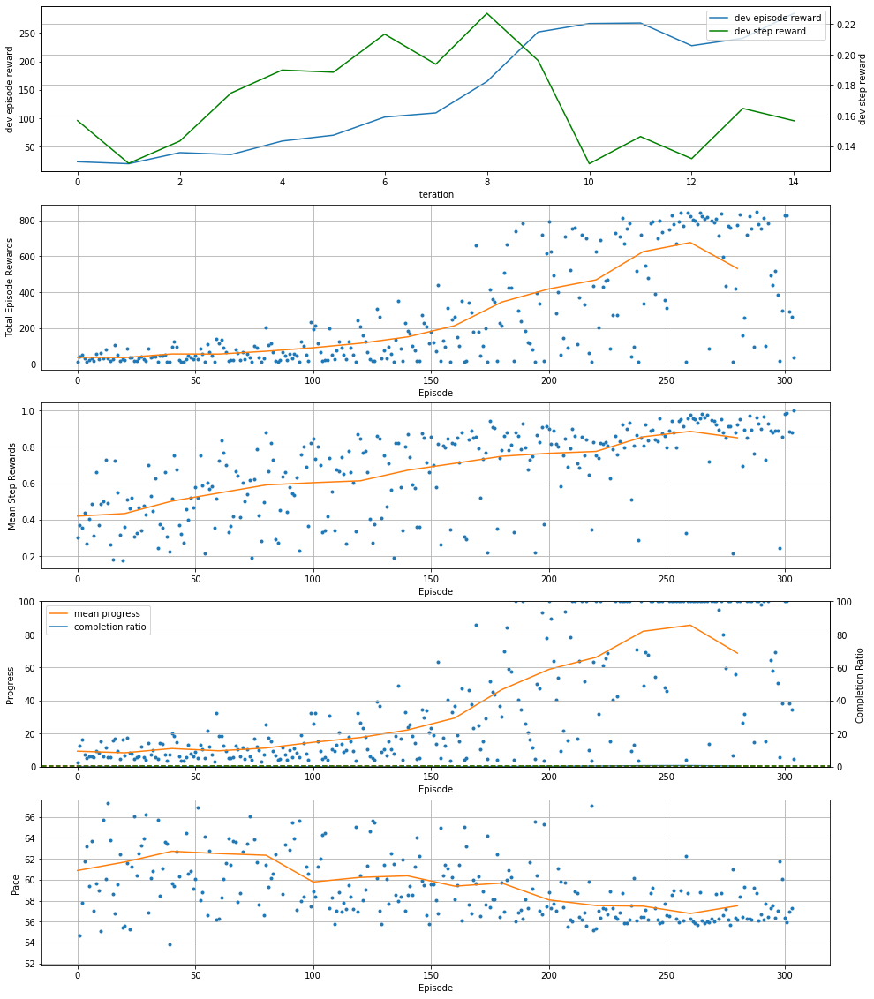
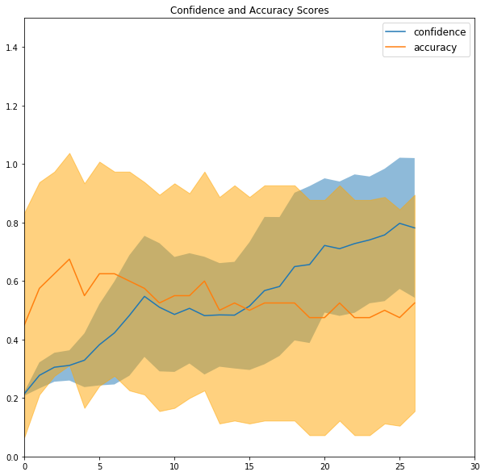

# Fast evaluation of DeepRacer models using still images

This is an experiment I put together while training an entry for the [AI Driving Olympics](https://driving-olympics.ai/) [Racing Event](https://driving-olympics.ai/?page_id=24) at NeurIPS. 

It's effectively an [AWS DeepRacer](http://deepracerleague.com/) event but with added focus on generalization to train the model to drive successfully on a variety of tracks and conditions.

## Goals

1. **Fast evaluation while training is ongoing**.  Ideal evaluation is to launch RoboMaker simulations for multiple tracks at each checkpoint, but it is rather slow and costly to be using as a guidance for when to stop training.
2. **Get deeper insight into model generalization**.  Evaluation on simulation does not effectively cover the variety of real-world conditions such as reflections.

## Theory

Taking a cue from typical image classifier training workflows, we create a test data set used only for evaluation.  Training will happen in ~2 simulated track environments while the test set will cover a much wider variety of simulated and real track surfaces

### 1) Collect Test Images

These are 160x120 RGB images which are converted to greyscale before they are run through the model for inference.


### 2) Image Labeling

Images were then manually categorized as simply left, right, or straight.  It tried not to choose too many ambiguous images.

```python
# Selection of various track images to 
eval_images = np.array([
    ['images/canada_training/174.png', LEFT],
    ['images/canada_training/1680.png', STRAIGHT],
    ['images/canada_training/290.png',LEFT],
    ['images/reinvent2018/154.png', LEFT],
    ['images/reinvent2018_carpet/127.png', STRAIGHT],
    ['images/reinvent2018_carpet/1375.png', RIGHT],
    ['images/kitchen/5.png', RIGHT],
    ['images/perturb/color_perturb_filter_1573533945.847555.png', STRAIGHT], # hue and contrast
    ['images/perturb/color_perturb_filter_1573534067.237829.png', LEFT], # brightness
    ['images/perturb/color_perturb_filter_1573534046.556981.png', STRAIGHT], # hue and brightness
    ['images/perturb/color_perturb_filter_1573534005.963595.png', STRAIGHT], # brightness
    ['images/manhattan/route.png', LEFT], # transition in flooring: light->dark
    ['images/manhattan/route-2.png', RIGHT], # transition in flooring: dark->light
    ['images/manhattan/route-4.png', STRAIGHT], # heavy reflections
    ['images/reinvent2018_wood/235.png', RIGHT],
    ['images/reinvent2018_wood/286.png', STRAIGHT],
    ['images/reinvent2018_wood/321.png', LEFT],
    ['images/china_track/123.png', LEFT],
    ['images/china_track/211.png', STRAIGHT],
    ['images/china_track/345.png', RIGHT]
])
```

### 3) Create an Evaluation Score

We generate 2 scores that are related but distinct.

1. **Confidence** - This is calculated by gathering the max action probability for each test image and calculating the mean.  Very high confidence is 1.0.
2. **Accuracy** - For each image if the action with the highest probability matches the label `LEFT`, `RIGHT`, or `STRAIGHT` then we assign score 1.0.  If it is not equal but adjacent (e.g. `STRAIGHT` instead of `LEFT`) then we assign score 0.5.  All others will be scored zero.


### 4) Run Evaluation During Training

Example plot with [pyplot](https://matplotlib.org/) 


## Results


### Experiment Data

All sessions were trained on `reinvent_wood` track since I liked the varying texture when aiming for generalization.  Hyperparameters were defaults from DeepRacer console.  Reward function was the sample "centerline" rewards.

Full simulations evaluations were 5 lap attempts on the tracks: `reinvent_base`, `reInvent2019_track`, `China_track`, and `Bowtie_track_mixture`.

| Experiment | Training Progress | Still Image Evaluations (every checkpoint) | Full Simulation Evaluation: Completed Laps (final checkpoint only) |
|---|---|---|---|
| Baseline training with default hyperparameters, 5 steering angles at speed 1m/s |  |  | **9** (5/1/0/3) |
| Add alternating directions |  |  | **13** (5/5/0/3) |
| 20% image augmentation |  |  | **6** (2/0/0/4) |
| Purposely overfitted to `reinvent_carpet` track |  |  | **9** (2/3/0/4) |
| Baseline but speed 2m/s |  |  | **9** (5/0/1/3)|

### Observations

- For the overfit experiment, its easy to see it indicated in the Still Image Evaluation where confidence is very high while accuracy is not very good.  My takeaway was to use the intersection of the two lines as a rough guide for the point of overfit.
- The image augmentation experiment should have been trained longer, though the "waterfall" pattern in progress graph seemed to me a systemic issue, possibly a bug.
- Speed 2m/s didn't lose any ground in the full simulation score, and had better accuracy score throughout the start of the training.  This may be due to some of the ambiguous test images preferring earlier turning at higher speeds and map better to my labeling.
- Alternating directions was the only one with tangible improvement in full simulation evaluation.

### Final NeurIPS AIDO Submission 

For my final submission to NeurIPS I used 
- 2m/s speed
- alternating directions
- 3 sequential training sessions on tracks `reinvent_wood` `China_track` and `Tokyo_training_track`
- early stopping of training based on the intersection of the accuracy and confidence measures from this experiment
- some final hyperparameter tuning just based on intuition and past experience.

This was enough to get a score of 20 in the Full Simulation Evaluation (i.e. all laps were successful on 4 tracks). 

### Conclusion

I'm not certain I can use the accuracy and confidence score as a difinitive measure of generalization but they do seem to correlate somewhat.  

If I had more time for the NeurIPS challenge I would try:

- larger test image set
- more aggressive augmentation (after sorting out any possible bugs)
- run experiments across multiple tracks (i.e. transfer learning)



